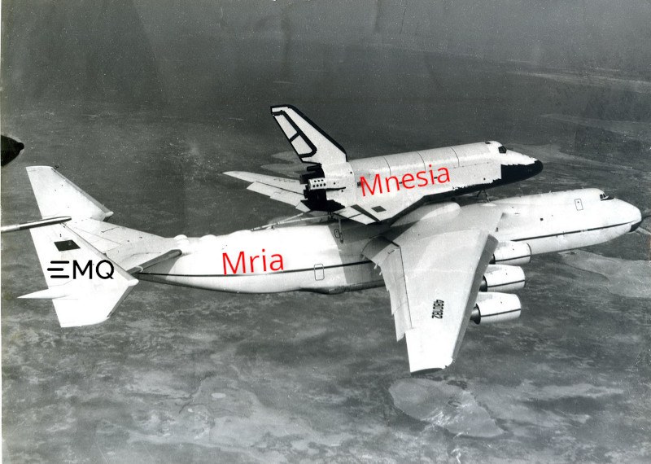

# Mria

Mria is an extension for Mnesia database that adds eventual consistency to the cluster.

## Motivation

Using Mria in RLOG mode aims to improve database write throughput in large clusters (4 nodes and more).

The default unpatched mnesia has two modes of table access:

* Local: when the table has a local replica.
  The current replication of Mnesia is based on a full-mesh, peer-to-peer Erlang distribution which does not scale well and has the risk of split-brain.
  Adding more replicas of the table creates more overhead for the writes.

* Remote: when the table doesn't have a local replica, and the data is read via RPC call to a node that has a table copy.
  Network latency is orders of magnitude larger than reading the data locally.

Mria aims to find the middle ground between the two approaches: data is read locally on all nodes, but only a few nodes actively participate in the transaction.
This allows to improve write throughput of the cluster without sacrificing read latency, at the cost of strong consistency guarantees.

## Logo



## Modes of operation

Mria works in two modes:

1. As a thin wrapper for Mnesia
1. In a so called `RLOG` mode (Replication LOG)

RLOG feature is disabled by default.
It can be enabled by setting `mria.db_backend` application environment variable to `rlog`.

## Node roles

When RLOG is enabled, each node assumes one of the two roles: `core` or `replicant`.
The role is determined by `mria.node_role` application environment variable.
The default value is `core`.
Core nodes behave much like regular mnesia nodes: they are connected in a full mesh, and each node can initiate write transactions, hold locks, etc.

Replicant nodes, on the other hand, don't participate in the mnesia transactions.
They connect to one of the core nodes and passively replicate the transactions from it using an internal Mria protocol based on [gen_rpc](https://github.com/emqx/gen_rpc/).
From the point of mnesia they simply don't exist: they don't appear in the `table_copies` list, they don't hold any locks and don't participate in the transaction commit protocol.

This means replicant nodes aren't allowed to perform any write operations on their own.
They instead perform an RPC call to a core node, that performs the write operation on their behalf.
Same goes for dirty writes as well.
This is decided internally by `mria:transaction` function.
Conversely, dirty reads and read-only transactions run locally on the replicant.
The semantics of the read operations are the following: they operate on a consistent, but potentially outdated snapshot of the data.

## Shards

For performance reasons, mnesia tables are separated into disjunctive subsets called RLOG shards.
Transactions for each shard are replicated independently.
Currently transaction can only modify tables in one shard.
Usually it is a good idea to group all tables that belong to a particular OTP application in one shard.

## Enabling RLOG in your application

It is important to make the application code compatible with the RLOG feature by using the correct APIs.
Thankfully, migration from plain mnesia to RLOG is rather simple.

### Assigning tables to the shards

First, each mnesia table should be assigned to an RLOG shard.
It is done by adding `{rlog_shard, shard_name}` tuple to the option list of `mria:create_table` function.

For example:

```erlang
-module(mria_app).

-behaviour(application).

-export([start/2, stop/1]).

-include_lib("snabbkaffe/include/trace.hrl").

start(_Type, _Args) ->
    ok = mria:create_table(foo, [{type, bag},
                                 {rlog_shard, my_shard},
                                 {storage, ram_copies},
                                ]),
    ok = mria:create_table(bar, [{type, ordered_set},
                                 {storage, ram_copies},
                                 {rlog_shard, my_shard}
                                 ]),
    mria:wait_for_tables([foo, bar]).
```

The API for creating the table is similar to Mnesia, with three notable exceptions:

1. `create_table` function is idempotent
1. All replicas of the table use the same storage backend, as specified by `storage` parameter, and each table is replicated on all nodes in the cluster
1. There is a mandatory `rlog_shard` parameter that assigns the table to an RLOG shard.
   The only exception is `local_content` tables that are implicitly assigned to `undefined` shard, that is not replicated

### Waiting for shard replication

Please note that replicant nodes don't connect to all the shards automatically.
Connection to the upstream core node and replication of the transactions should be triggered by calling `mria:wait_for_tables(Tables, Timeout)` function.
Typically one should call this function in the application start callback, as shown in the example above.

### Write operations

Use of the following `mnesia` APIs is forbidden:

* `mnesia:transaction`
* `mnesia:dirty_write`
* `mnesia:dirty_delete`
* `mnesia:dirty_delete_object`
* `mnesia:clear_table`

Replace them with the corresponding functions from `mria` module.

Using transactional versions of the mnesia APIs for writes and deletes is fine.

With that in mind, typical write transaction should look like this:

```erlang
mria:transaction(my_shard,
                 fun() ->
                   mnesia:read(shard_tab, foo),
                   mnesia:write(#shard_tab{key = foo, val = bar})
                 end)
```

### Read operations

Dirty read operations (such as `mnesia:dirty_read`, `ets:lookup` and `mnesia:dirty_select`) are allowed.
However, it is recommended to wrap all reads in `mria:ro_transaction` function.
Under normal conditions (when all shards are in sync) it should not introduce extra overhead.

## Callbacks

Mria can execute callbacks on some system events.
They can be registered using `mria:register_callback/2` function.

- `stop`: This callback is executed when the DB stops or restarts.
- `start`: This callback is executed when the DB starts or restarts.

Note that the DB restarts when the node joins the cluster.
